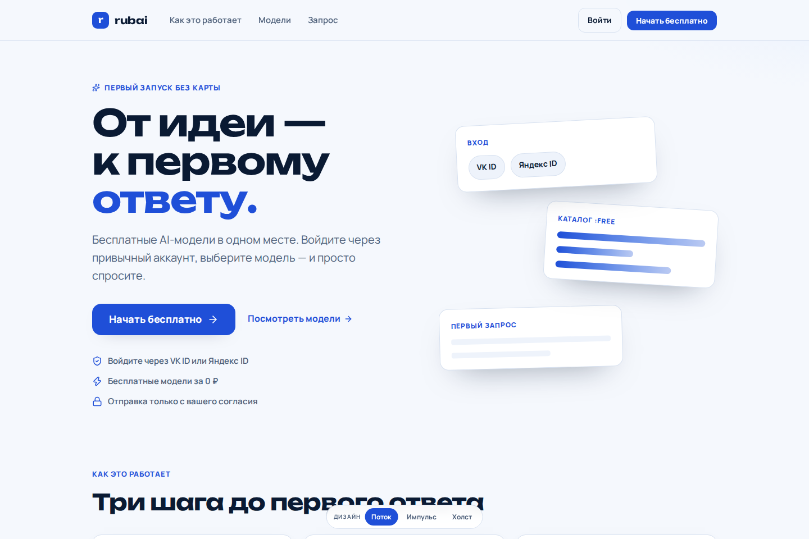
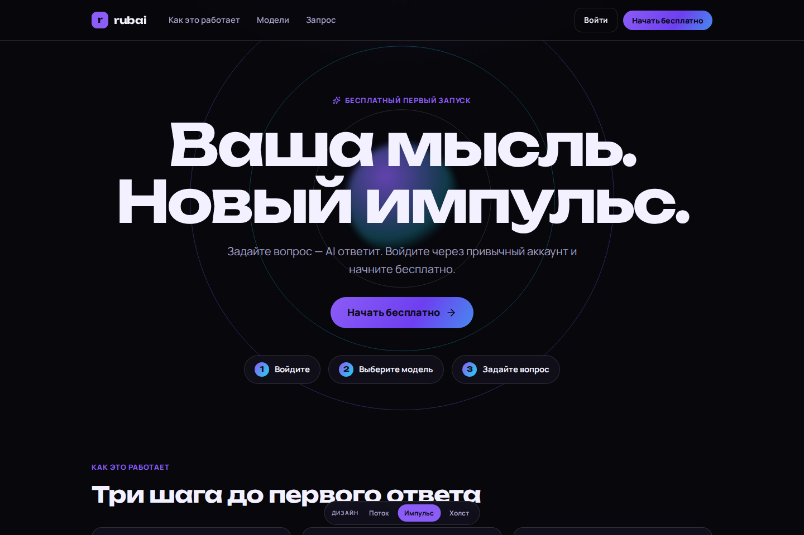

# Итерация: три интерфейса первого запуска

## Согласованный объём

Владелец после объединения PR #2 запросил три разных дизайна **одного** продукта, с настоящим входом **VK ID и Яндекс ID** и первым запросом к бесплатной модели OpenRouter. Выбран локальный запуск. Владелец сообщил о полученном разрешении OpenRouter и о зарегистрированных OAuth-приложениях; подтверждающие документы не передавались и независимо не проверялись.

Разрешена разработка этой ограниченной итерации. Это не закрывает все задачи этапа 0 и не является разрешением на публичный production или приём денег.

- Три отдельных композиции: `flow`, `pulse`, `canvas`, общий сценарий и общие серверные adapters.
- Новое приложение `apps/web` на Next.js/TypeScript. Архив не импортируется; старые billing/payment handlers не используются.
- Для локальной итерации Next.js route handlers выполняют роль BFF: OAuth, локальная сессия, чтение реального каталога и защищённый запрос к OpenRouter. Это не решение о переносе будущего финансового backend из FastAPI и не второй источник баланса.
- Нет платежей, денежных балансов, платных моделей, долговременной истории чата, выдачи production API-ключей, команды или admin-панели.
- Вход создаёт локальную сессию, не полноценный постоянный аккаунт платформы. Финальные таблицы пользователей, блокировки, отзыв сессий между репликами и backend identity остаются отдельными задачами.
- Никаких вымышленных AI-ответов или кнопок «демо-вход» в приложении. Без настроенных credentials соответствующая интеграция явно недоступна.

## Локальный адрес

Официальная [инструкция VK ID](https://id.vk.ru/about/business/go/docs/ru/vkid/latest/vk-id/connection/create-application) ограничивает localhost портами 80/443. Next.js работает без root на `127.0.0.1:3001`; отдельный временный loopback-прокси предоставляет `http://localhost`. Владелец разрешил такую настройку. Публичный туннель, firewall и автозапуск не настраиваются.

Зарегистрировать в существующих OAuth-приложениях:

- VK ID: базовый домен `localhost`, redirect `http://localhost/api/auth/callback/vk`.
- Яндекс ID: redirect `http://localhost/api/auth/callback/yandex`, scope `login:info`.
- VK confidential app: сервисный ключ и разрешённый исходящий IP backend; не подменять тип приложения. Режим public поддерживается только при соответствующей настройке у самого провайдера.

Настоящие credentials — только в `apps/web/.env.local`, скопированном из `.env.example`. Никаких секретов в `NEXT_PUBLIC_*`, скриншотах, issues или PR.

## Проверки и ограничения

Проверка верстки/контрактов с тестовыми ответами в автоматических тестах не подтверждает настоящий OAuth. Каждый live-provider требует отдельного успешного входа; настоящий AI-запрос требует серверного ключа, авторизованной сессии и согласия на передачу текста провайдеру. Владелец затем решил подключить credentials позже и попросил завершить интерфейсы/код. Поэтому настоящий OAuth и AI-ответы не отмечаются проверенными.

Тариф `:free` не означает безлимитность или SLA. Каталог и квоты меняются; платный fallback запрещён. Локальный single-process ограничитель не заменяет Redis и защиту production. Обычный HTTP допустим здесь только на loopback; публичные адреса этой итерацией не поддерживаются.

## Реализовано

- Три адаптивных композиции, заметные CTA, общий диалог входа, переключение дизайнов, выбор модели с клавиатуры, форма первого запроса, явное согласие, отмена, безопасное отображение/копирование ответа и выход.
- Серверные Authorization Code + PKCE adapters для VK ID и Яндекс ID. Одноразовые state/browser-binding, opaque HttpOnly cookies и ограниченные временные server-side сессии. Никаких password/API-key форм в публичном UI.
- Чтение настоящего каталога OpenRouter с фильтрацией нулевых тарифов; защищённая генерация только через сервер, без платного fallback, с ограничением запросов и аварийной остановкой при неизвестной/ненулевой стоимости.
- Инструкция подключения и локальный loopback-прокси; секреты/история/артефакты тестов исключены из Git. Proxy не является службой и не запускается автоматически.

## Фактически выполненные проверки

| Проверка | Результат |
| --- | --- |
| `npm test` | 78 unit/security tests прошли; provider HTTP подменён только внутри тестов |
| `npm run typecheck` | Прошла |
| `npm run build` | Оптимизированная сборка прошла |
| `npm run test:e2e` | 16 браузерных тестов прошли, desktop/mobile, все три дизайна; API подменены только тестом |
| Реальное чтение каталога | Через приложение получены 17 подходящих `:free` моделей на момент проверки |
| Ручная браузерная проверка | CTA/диалог, переключение дизайнов, раскрытие каталога, выбор модели; скриншоты desktop и 375px mobile, горизонтального overflow нет |
| HTTP-границы | Проверены отказ на POST без правильного Origin и отказ неавторизованной генерации |
| `npm audit --omit=dev` | На момент проверки известных уязвимостей не найдено; это не полноценный security-аудит |
| Real VK ID / Яндекс ID | **Не проверены:** владелец отложил credentials и callback-настройку |
| Настоящий AI-ответ | **Не проверен:** серверный ключ и авторизованная сессия ещё не предоставлены |

E2E fixtures не попадают в runtime приложения. Успех offline-тестов не заменяет два настоящих OAuth-входа и реальный первый запрос.

## Сравнение дизайнов

### Поток

Светлый интерфейс, синий основной CTA и карточная композиция.

### Импульс

Тёмный интерфейс, центральная типографика и градиентный CTA.

### Холст

Тёплая подложка, контрастная модульная сетка и лаймовые акценты.

Запуск, конфигурация и ручная live-приёмка: [apps/web/README.md](../apps/web/README.md).

## Источники интеграций

- [VK ID — настройка приложения и localhost](https://id.vk.ru/about/business/go/docs/ru/vkid/latest/vk-id/connection/create-application).
- [VK ID — authorize, token, user_info](https://id.vk.ru/about/business/go/docs/ru/vkid/latest/vk-id/connection/api-description).
- [Яндекс ID — Authorization Code и PKCE](https://yandex.ru/dev/id/doc/ru/codes/code-url).
- [Яндекс ID — информация о пользователе](https://yandex.ru/dev/id/doc/ru/user-information).
- [OpenRouter — free variants](https://openrouter.ai/docs/guides/routing/model-variants/free).
- [OpenRouter — provider routing и max_price](https://openrouter.ai/docs/guides/routing/provider-selection).

Это технические источники, не подтверждение коммерческого разрешения. До публичного запуска также требуется проверка точного оформления брендовых OAuth-кнопок и правовых документов.
